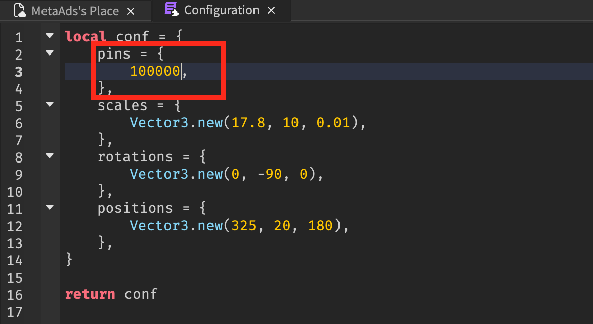

# Roblox and MetaAds integration tutorial

## Set up MetaAds Display

### Download MetaAds screen files

1. Connect to account on [MetaAds main page](https://metaads.team/main/) with Metamask.
2. Click on *Landowner*.
3. Click on *My Ad Spaces*.
4. Click on [Add Ad Space](https://metaads.team/main/publisher/my-adspaces).
5. Select Roblox metaverse.
6. Download files.
7. Click on *Next*.

8. Enter name and description.
9. Upload a preview picture, this picture will be associated with your ad spot.
10. Insert a link to the roblox image to display the default image on Ad Space, a teleport to some place triggered by click on Ad Space can be added too, if you have uploaded a default image. [How to get link to Roblox image?](#how-to-get-link-to-roblox-image)

11. Click on *Save*.

### Registration in Roblox and download of necessary environment

> Skip this section, if you have an account in Roblox, Roblox application and Roblox Studio, otherwise set up missing elements.

12. Download Roblox and Roblox Studio.
13. Register account on [Roblox](https://roblox.com).
14. Open [page for creators](https://www.roblox.com/create).
15. Click on *Start Creating* to download Roblox Studio.

### Working in Roblox Studio

> Skip 16th step, if you have already a place and wish set up our screen on created place.

16. Click on *New* and select template to create a new game.
17. Open your place.
18. Unzip the downloaded folder, there are the next files:

19. Open *ReplicatedStorage* folder.
20. Drag the file to Roblox Studio to *ReplicatedStorage*.
21. Open *ServerScriptService* folder.
22. Drag the file to Roblox studio to *ServerScriptService*.
23. Open *StarterGui* folder.
24. Drag the file to Roblox studio to *StarterGui*.
25. You should get the next result:

26. Copy the contents of the Environment file from downloaded files to Roblox studio: *ReplicatedStorage* -> *MetaAds* folder -> *Environment*.

### Configuration file

It consists all sizes and positions for your displays.
The next parameters are the following tables:

+ *pins*. The table of display PINs that you get after ad space creation.
+ *scales* contains available display sizes. Size a three-component variable. First and second numbers are width and height.
Third number is dummy variable and it always equals *0.01*, because display should be thin.
+ *positions* has the same dimension, but its three variables are x, y and z. The position of the display's center on all three axes.
+ *rotations*. Euler angles, the more common x, y and z notation with numbers that go from 0 to 360.
The values are set up by default if the screen is put vertically. If you wish to rotate the display forward or backward, change the first parameter. If you wish to rotate it left or right, change the second value. And if you wish to tilt left or right, use the third parameter.

27. In Roblox Studio open ReplicatedStorage.
28. Open Configuration file in MetaAds folder.
29. Go to MetaAds site, find your ad spot, open its info and get a PIN.

30. Copy PIN and paste in Configuration file.

### Roblox game settings

31. Open *Game Settings* at *Home* tab.

32. Click on *Save* to Roblox.

33. Set up place's basic info: enter name and description (optional).

34. Open *Permissions* and select *Public*.

35. Open *Security*, ennable *Allow HTTP Requests* and *Allow Third Party Teleports*.

36. Click on *Save*.
37. Click on *Play* to test locally.

38. Publish to Roblox.
39. Open your game in Roblox application.

## How to get link to Roblox image?

1. Install [BTRoblox - Making Roblox Better](https://chrome.google.com/webstore/detail/btroblox-making-roblox-be/hbkpclpemjeibhioopcebchdmohaieln) extension to your browser.
2. Open page with Roblox images. They can be stored at your inventory or you can get them from common accessable [Roblox library](https://create.roblox.com/marketplace/images?source=library).

3. Select and open image.
4. Click on Explorer button.
5. Click on Decal.
6. Copy link.

## How to upload your own image to Roblox?

1. Open [page for upload *Decal*](https://create.roblox.com/creations?activeTab=Decal).
2. Click on *Development items*.
3. Click on *Decals*.
4. Click on *Upload Asset*.

5. Click on *Upload*.
6. Select image from your PC.
7. Click on Upload button.

8. Wait for moderation pass.
9. Get link like [there](#how-to-get-link-to-roblox-image).

## How to upload image to MetaAds?

1. Connect on [MetaAds](https://meta-dev.eastrelay.com/main) with Metamask.
2. Click on *Advertiser*.
3. Click on *My Creatives*.
4. Click on *Add Creative*.
5. Select Roblox.
6. Paste link to Roblox image like [there](#how-to-get-link-to-roblox-image).
7. Upload preview image.

8. Click on Next.
9. Enter name, description and place ID (optional) to teleport by click when current creative is showing.
10. Click on Save.

